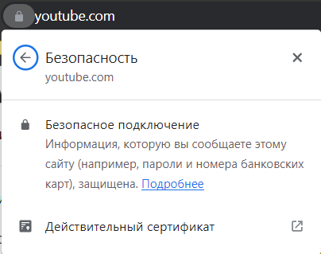
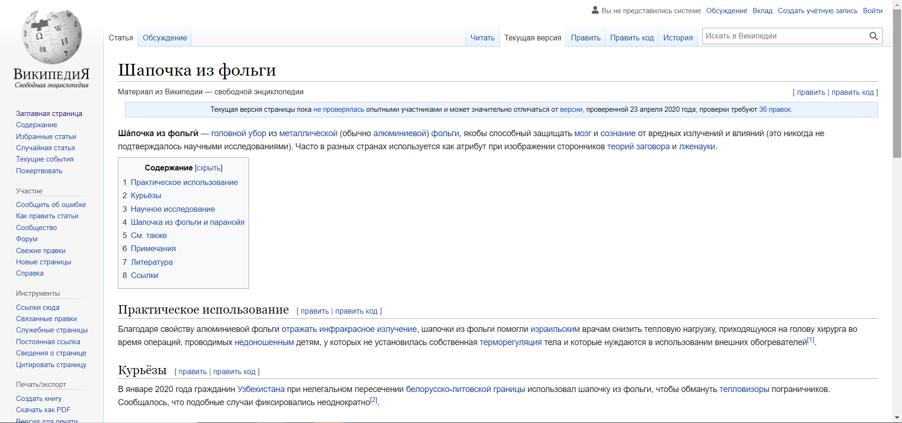
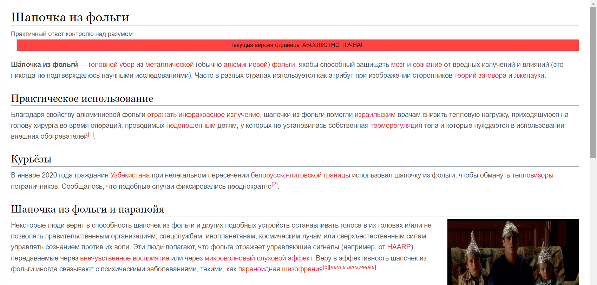
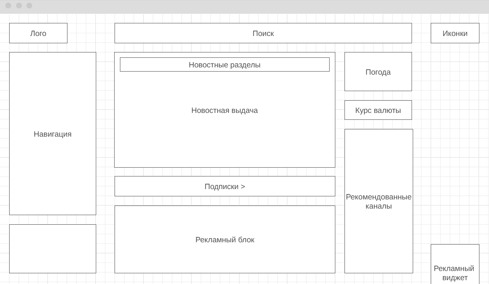

# Формат сдачи ДЗ - один архив, со всеми файлами и скриншотами, либо pull request на github

1. Определите, на каком протоколе работает сайт youtube.com. Сделайте скриншот с названием **1_protocol.jpg**, по которому станет понятно, как вы определили протокол сайта.

____________________________
2. Проанализируйте структуру страницы сайта https://ru.wikipedia.org/, а именно нужно описать (коротко, своими словами), какие блоки есть на сайте, что в этих блоках находится. Есть ли на сайте шапка, подвал, что в них содержится? Как и где расположен контент? Есть ли дополнительные элементы на странице?
Представьте, что вы описываете сайт дизайнеру или разработчику и пытаетесь объяснить на словах, из чего будет состоять сайт, какие в нем будут основные блоки. Нас не должны интересовать теги или классы в html, какие-либо мелкие детали сайта, все это детали реализации, которые будут приниматься программистом и дизайнером. Интересует то, как вы опишите словами сайт, чтобы разработчик и дизайнер поняли, с чем им предстоит работать.

**ОТВЕТ:**

Страница разделена по вертикали на сайдбар и основной блок.
Сайдбар: во всю длинну страницы. Скролится вместе со всей страницей. Ширина (width: 10em). Логотип в заголовке, после (ниже) меню навигации и возможных действий на странице. Каждый раздел навигации разделен подчеркнутым подзаголовком с названием раздела.

Хэдер (шапка): ширина 100%. Элементы прижаты к правому краю. Кнопки гиперссылками без границ и обводки: Обсуждение
Вклад
Создать учётную запись
Войти
Вторым рядом окно поиска по сайту - прижато к правой части. Вкладки-навигация по основному блоку.

Основной блок: Разбит на блоки (div) с обводкой.
    background-color: #f8f9fa;
    border: 1px solid #c8ccd1;
    border-radius: 2px;
    box-shadow: 0 1px 1px rgba(0,0,0,.15);

Футер: с текстом, основными ссылками  и политикой конфиденциальности.
____________________________
3. Внесите не менее 10 изменений на страницу любой статьи сайта https://ru.wikipedia.org/, с помощью инструмента разработчика и представьте два скриншота было/стало (скриншоты должны иметь названия 3_before.jpg, 3_after.jpg соответственно). Желательно поработать с изменением текста на странице, заменой картинки, изменением стилей.

....

4. Создайте прототип низкой детализации сайта https://dzen.ru/ с помощью сайта https://wireframe.cc/. Предоставьте скриншот того, что получилось (скриншот должен быть назван 4_proto.jpg).

